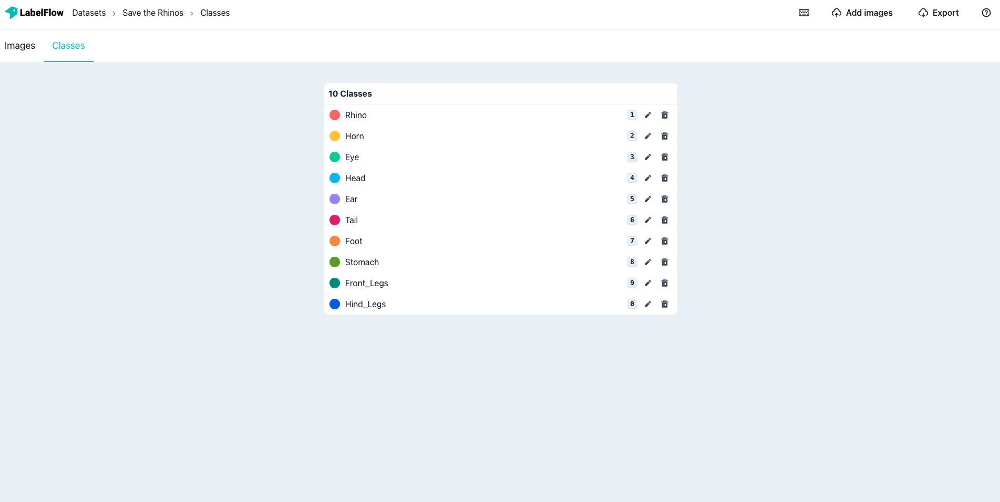

# Classes

A class is a category in which labels are classified. It helps group similar labels together, which is essential for any labeling project. A class is defined by its name and has its own color to help differentiate it from the others.

### Create New Classes

When you create a new labeling project, it comes with the default class "None". These are the simple steps you need to take to create more labels

1. Right-click on an existing label
2. Click on the search field and write the name of the new class
3. Press enter or click on the button that says "Create class \[New\_Class\] "



### Edit Classes

The classes tab in your project space shows all the information about all the classes in your project. The total number of classes is also visible to help you.

You can change the name of a class by selecting the edit icon and giving your class a new name.

You can also delete a class and all labels associated with it will be classified as "None".

